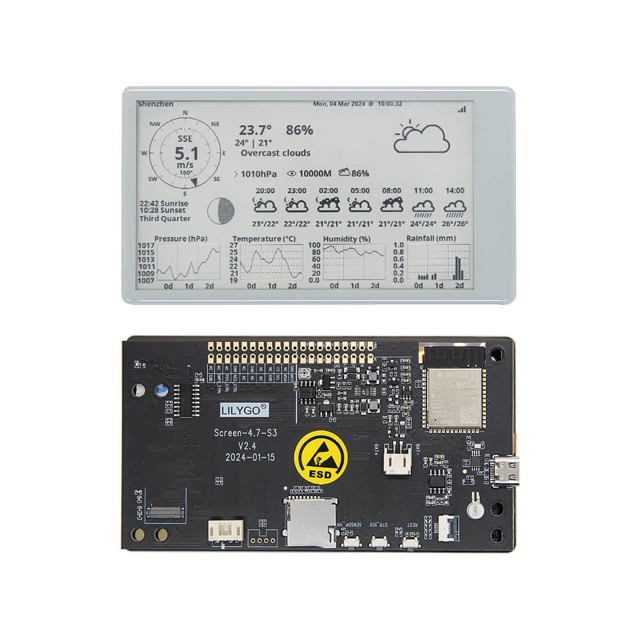
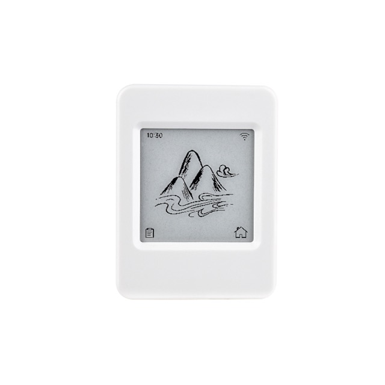
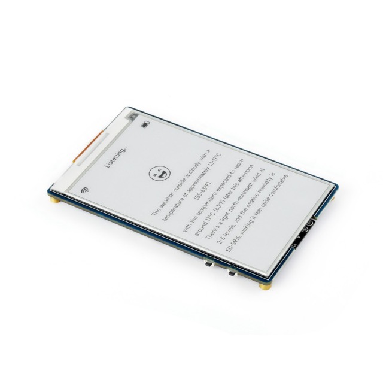
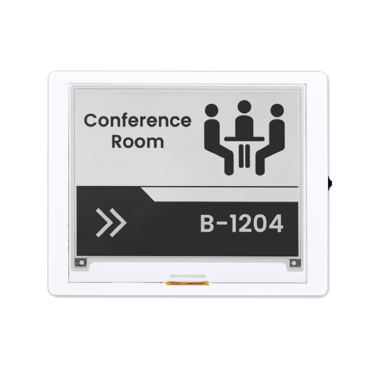
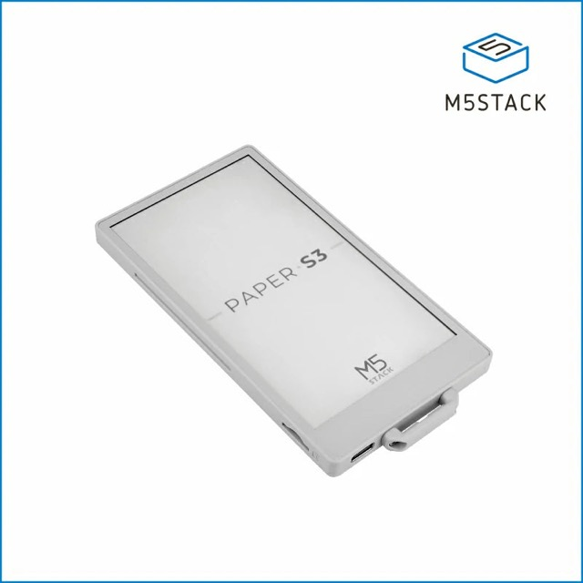
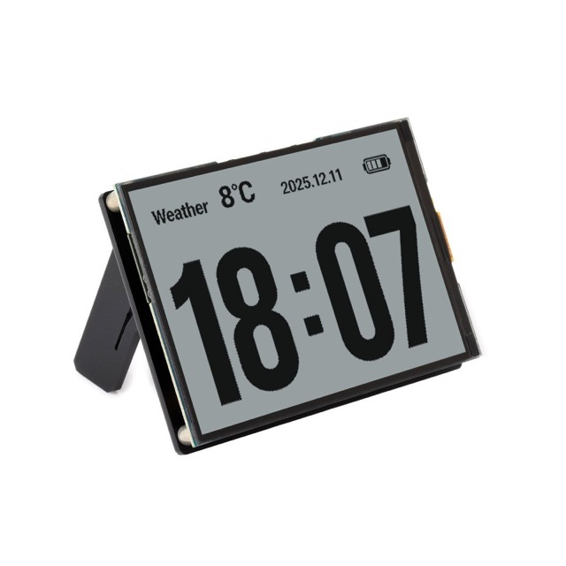
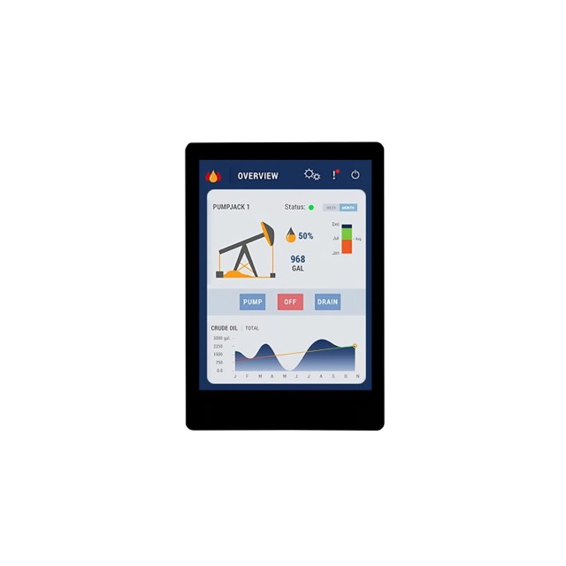
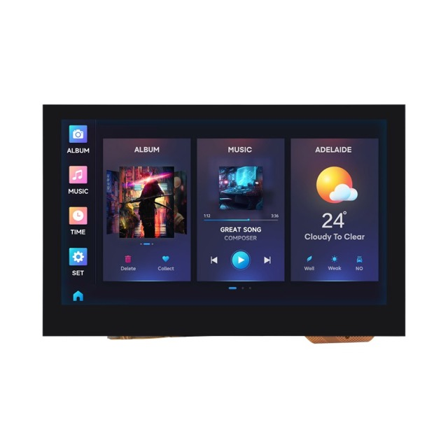

<!-- Copyright (c) 2026 FanXeon@Poemcoder with Codex -->

# 米遥 → AI Coding 桌面控制台 计划

[路线图](ROADMAP.md) · [按键预设](BUTTON_PRESETS.md) · [使用说明](USAGE.md)

**状态：提案（2026-09），尚未开工。** 2026-09-17 补充了 [市场调研与多维对比](research/AGENT_PLATFORM_LANDSCAPE.md)：AgentDeck 已实现多表面 + 墨水屏合同 + 审批，Home Assistant 覆盖 IoT；调研建议本文第 4 节副屏协议降级为轻量后备，优先评估作为 AgentDeck companion 接入并经 MQTT 桥接 Home Assistant（待拍板，见调研第 6–7 节）。 本文记录一次对市面 AI Coding 硬件的调研、米遥能低成本复刻的能力清单、分阶段计划，以及后续接入桌面小屏 / 开发板副屏的接口设计。所有阶段都不修改遥控器固件——小米 2 Pro 只开放 ATVV 语音和 HID 按键，米遥的硬件面固定为 **12 个按键 + 按住说话麦克风**，其余能力全部在 Mac 侧实现。

## 1. 市场参照

| 产品 | 价格 | 核心能力 |
| --- | --- | --- |
| OpenAI Codex Micro（kbd-1.0，Work Louder 代工，2026-07） | $230 | 6 个 Agent 键，RGB 实时显示线程状态：白＝空闲、蓝＝处理中、绿＝完成、琥珀＝等待输入、红＝错误；命令键：接受 / 拒绝 / 分支 / PTT / 新会话；摇杆走 PR review、debug、refactor 流程；推理强度旋钮；6 层配置 |
| Logitech MX Keypad（2026-09） | $99 | 9 个 LCD 键按前台 App 切配置；prompt 宏；Logi Actions SDK；社区插件给 Claude Code / Codex 做 agent 状态跟踪与终端控制 |
| Stream Deck 插件（ClaudeButtons、streamdeck-claude-monitor、agentsd、AgentDeck） | 复用设备 | 通过 Claude Code hooks 拿会话状态：idle / working / waiting / 需要审批；一键 approve / deny；上下文用量环；多会话聚焦 |
| ESP32 桌面小灯（claude-status-display） | $20 | 一块小屏 + RGB LED：agent 等你时变色，显示上下文与限额 |
| Claude Code 语音模式 / Remote Control | 免费 | 在终端里按住空格说话；手机远程起会话 |

三条共同主线：

1. **状态外显**——不盯屏幕也知道 agent 是在跑、跑完了，还是在等你点头。
2. **一键决策**——接受 / 拒绝 / 切会话 / 新会话。
3. **prompt 宏**——常用指令一键发送。

米遥没有灯和屏，反馈通道分两级：近处靠 **菜单栏图标 + macOS 通知中心**，离桌靠 **桌面副屏**（第 4 节）。决策通道用现有按键，宏走现有发送链路。**不用声音**（提示音 / TTS）——在办公与共处环境里突兀，且遥控器场景本来就伴随屏幕或副屏。

## 2. 能力清单与成本

| # | 能力 | 对标 | 硬件侧 | 软件侧 | 成本 |
| --- | --- | --- | --- | --- | --- |
| 1 | Agent 状态回传：菜单栏图标变色 + 通知中心横幅 + 状态文件（供副屏） | Codex Micro 状态灯 | — | `mi-ao notify <event>` 子命令；Claude Code `Notification` / `Stop` hooks 与 Codex CLI `notify` 各一行配置；运行时收事件后改图标、发通知、写状态文件 | 低 |
| 2 | 多 agent CLI：Claude Code、Gemini CLI、OpenCode、Cursor agent | Claude Code 语音模式 | — | 定位器多认几个进程名；投递、聚焦、切 Tab 全部复用 | 极低 |
| 3 | 审批态：等审批时 确认＝`y`/Enter、返回＝`n`/Esc，菜单栏显示在等什么 | Stream Deck approve/deny | 复用 确认 / 返回 | 依赖 #1 的事件；按键动作已有 | 低 |
| 4 | Prompt 宏：按键绑定"发送文本" | MX Keypad 宏 | 复用任意键（长按） | 新增 `ButtonBinding.prompt(String)`，走 `CodexController.submit` | 低 |
| 5 | 录音 / 发送的可视反馈：菜单栏图标在录音 / 处理 / 已发送 / 失败四态之间切换，失败时发通知横幅 | 状态灯 | — | 菜单栏图标已有大半，补失败通知与更明显的录音态 | 极低 |
| 6 | 语音指令："米遥，切到第二个会话 / 撤销 / 换成 o3" | Codex Micro 推理旋钮、Agent 键 | 复用语音键 | 转写前缀路由到指令表；`/model` 等通过发送链路下发 | 中 |
| 7 | 结果摘要：agent 回复完成后把最后几行推到通知中心 / 副屏 | Remote Control 的"离桌"场景 | — | tmux 路 `capture-pane` 取最后 N 行；终端 App 路暂不支持 | 中 |
| 8 | "评审"预设：方向环＝j/k/PageUp/Down，左右＝上/下一个文件，确认＝approve | Codex Micro 摇杆 | 复用方向环 | 一份内置预设 JSON | 极低 |

## 3. 分阶段

### P0 · 看得见的状态（目标：一天）

- [ ] #5 录音 / 发送四态图标与失败通知：菜单栏图标补"处理中"与"失败"两态，失败发通知横幅（通知中心权限按需申请）。
- [ ] #2 多 agent：`CodexCLIProcessTable.isCodexCLI` 扩成 `AgentCLI` 表（`codex`、`claude`、`gemini`、`opencode`）；向导"Codex CLI"文案改成"Agent CLI"，检测卡按发现的 agent 分别显示。
- [ ] #1 状态回传：
  - `mi-ao notify --agent codex --event <working|done|awaiting-input|awaiting-approval|error> [--message …]`，经分布式通知转给运行时；
  - 运行时把事件写进 `runtime-status.json`（新增 `agent` 字段：agent 名、事件、时间、消息），菜单栏图标按事件切换（蓝 / 绿 / 琥珀 / 红，对齐 Codex Micro 语义），`done` / `awaiting-*` / `error` 发通知中心横幅（可在偏好里按事件关闭）；
  - 向导"语音"页新增 "Agent 状态" 卡；`doctor` 打印一份可粘贴的 hook 配置片段（Claude Code `settings.json` hooks，Codex `~/.codex/config.toml` 的 `notify`）。
- 验收：Codex CLI 跑一条长任务，完成时菜单栏变绿并弹出横幅；需要审批时菜单栏变琥珀、横幅显示待审批内容。

### P1 · 一键决策与宏（目标：两天）

- [ ] #3 审批态：收到 `awaiting-approval` 后进入待审批态，菜单栏显示消息，确认 / 返回键在该态下分别发 `y` / `n`（可配置）；任意语音发送或超时退出该态。
- [ ] #4 Prompt 宏：按键配置页新增"发送文本"绑定，支持 `{clipboard}` 占位；内置几条示例（继续、运行测试并修到通过、提交、解释报错）。
- [ ] #8 评审预设：内置 `review` 套装，TV 可跳转。
- [ ] #6 语音指令（第一批）：`切到第 N 个会话`、`上一个 / 下一个会话`、`撤销`（发 Esc）、`停止`（发 Ctrl+C）。

### P1.5 · 按键手势与模式层（目标：三天）

见第 5 节。手势识别器 + 预设格式升级 + 三类新动作（运行快捷指令 / 命令、发送文本、切模式层）。先做 20 秒和弦验证决定是否支持真正的同时按键。

### P2 · 桌面副屏协议与网页副屏（目标：三天）

第 4 节的协议文档、状态总线、网页副屏、协议测试。硬件一块都不买，先把接口定死。

### P2.5 · 硬件副屏（目标：一周，含硬件验证）

墨水屏参考固件优先；协议不为硬件改动，只补传输层（串口 / BLE）。

### P3 · 待评估

- #7 结果摘要：需要把 agent 输出与 TUI 装饰分离，先只做 tmux 路的"最后 N 行"粗版，推到通知中心与副屏。
- 非 tmux 终端的多 Tab 精确定位：Ghostty / WezTerm / kitty 各有自己的 IPC，按需逐个接。

## 4. 桌面副屏：先定协议，再选硬件

目标：把 Codex Micro 那六盏状态灯做成一块独立的桌面副屏——墨水屏、小 LCD、开发板、旧手机都行。米遥当中枢，副屏只负责显示（可选带几个决策键）。**硬件之前先把协议做成设备无关的**：任何能说 JSON 的东西都能接，米遥侧不为某块板子写特例。

### 4.1 设计原则

1. **快照 + 事件**：设备随时能拿一份全量快照自恢复；平时只收增量事件。断线重连不需要记状态。
2. **设备自报能力**：接入时声明自己是什么（墨水屏 / LCD / 纯 LED / 网页）、分辨率、色深、最小刷新间隔、有哪些按键。米遥据此决定推送节奏和内容裁剪，而不是设备去适配米遥。
3. **一份模型，多种传输**：JSON 行协议不变，传输层可换：localhost HTTP+SSE、WebSocket、USB 串口、BLE（远期）。
4. **控制单向收敛**：副屏发来的动作只是"请求"，是否执行由米遥按当前状态决定；副屏永远不直接碰终端。
5. **版本化**：`protocol` 整数版本，向后兼容加字段不加版本，破坏性改动才升。

### 4.2 状态模型 v1

米遥维护的全量快照（`GET /v1/status` 或串口 `snapshot` 帧）：

```json
{
  "protocol": 1,
  "host": { "name": "jandyx-mbp", "app": "mi-ao 0.3.0", "updatedAt": "2026-09-17T06:12:03Z" },
  "voice": {
    "state": "ready",
    "label": "已就绪 · 按住语音键说话",
    "remote": { "connected": true, "battery": null },
    "issue": null
  },
  "agents": [
    {
      "id": "codex:tmux:%3",
      "kind": "codex",
      "title": "mi-ao",
      "where": "tmux %3 · iTerm2",
      "state": "awaiting-approval",
      "message": "Run: swift test",
      "since": "2026-09-17T06:11:40Z",
      "focused": true
    }
  ],
  "lastTranscript": { "text": "运行测试并修到通过", "at": "2026-09-17T06:10:02Z", "target": "Codex CLI", "submitted": true },
  "pending": { "type": "approval", "agentId": "codex:tmux:%3", "options": ["approve", "deny"] }
}
```

- `voice.state`：`starting | searching | ready | recording | processing | sent | reconnecting | sleeping | error`。
- `agents[].state`：`idle | working | done | awaiting-input | awaiting-approval | error | gone`，颜色语义对齐 Codex Micro：白 / 蓝 / 绿 / 琥珀 / 琥珀 / 红 / 灭。
- `pending`：米遥当前等用户做的决定；副屏据此显示按钮，也是它能发 `approve` / `deny` 的唯一窗口。

事件（`GET /v1/events` SSE 或串口 `event` 帧），每条带单调递增 `seq`，设备重连时用 `Last-Event-ID` / `since` 续传，续不上就重拉快照：

```json
{ "protocol": 1, "seq": 1042, "at": "…", "type": "agent.state", "agentId": "codex:tmux:%3", "state": "done", "message": "已完成" }
{ "protocol": 1, "seq": 1043, "at": "…", "type": "voice.state", "state": "recording" }
{ "protocol": 1, "seq": 1044, "at": "…", "type": "transcript", "text": "…", "target": "Codex CLI", "submitted": true }
{ "protocol": 1, "seq": 1045, "at": "…", "type": "pending", "pending": { … } | null }
{ "protocol": 1, "seq": 1046, "at": "…", "type": "heartbeat" }
```

### 4.3 设备接入（hello）与推送节奏

设备连上后第一帧自报能力：

```json
{
  "protocol": 1,
  "type": "hello",
  "device": { "id": "eink-desk-01", "name": "桌面墨水屏", "firmware": "0.1" },
  "display": { "kind": "eink", "width": 296, "height": 128, "colors": 2, "minRefreshMs": 15000, "partialRefresh": true },
  "inputs": ["approve", "deny", "focus-next"],
  "wants": ["agents", "voice", "pending", "transcript"]
}
```

米遥回 `hello-ack`（含快照）并按能力裁剪：

| 显示类型 | 推送策略 |
| --- | --- |
| `eink` | 只在状态 **变化** 时推，且合并 `minRefreshMs` 内的多次变化；`recording` 这类秒级状态不推，只推最终结果；文本按 `width` 截断 |
| `lcd` / `oled` | 变化即推，允许 `recording` 呼吸态 |
| `led` | 只订阅 `agents[].state` 与 `pending`，其余不发 |
| `web` | 全量事件流 |

`heartbeat` 默认 30 s；设备连续两次没收到视为断线自行显示"离线"。

### 4.4 反向动作

设备只发请求，米遥决定是否执行：

```json
{ "protocol": 1, "type": "action", "action": "approve", "agentId": "codex:tmux:%3", "requestId": "r-17" }
{ "protocol": 1, "type": "action-result", "requestId": "r-17", "ok": false, "reason": "no pending approval" }
```

动作集合 v1：`approve`、`deny`、`focus`（切到该 agent 的窗格 / Tab）、`retry-voice`、`send-text`（等价一次语音转写，走同一条发送链路，可选带 `agentId`）。`approve` / `deny` 仅在 `pending` 存在且 `agentId` 匹配时生效，否则返回 `no pending approval`。

### 4.5 传输层

| 传输 | 适用设备 | 说明 |
| --- | --- | --- |
| HTTP + SSE（默认，`127.0.0.1`） | 网页、手机、Wi-Fi 开发板 | `GET /v1/status`、`GET /v1/events`、`POST /v1/actions`、`POST /v1/hello`；局域网模式需在偏好显式开启，带一次性 token（`Authorization: Bearer`），mDNS 广播 `_mi-ao._tcp` |
| WebSocket（`/v1/ws`） | 同上，需要双向 | 同一套 JSON 帧，省去 SSE + POST 两条连接 |
| USB 串口 CDC（非目标，仅调试） | 刷机 / 调试口 | 每行一帧 JSON（NDJSON）；正式副屏一律无线，串口只用于开发期抓帧 |
| BLE 外设（远期） | 电池墨水屏 | 米遥作 central，GATT 上跑同一 NDJSON；与遥控器共用 CoreBluetooth，需评估干扰 |

`mi-ao status --watch` 作为参考客户端，也是协议回归测试的夹具。

### 4.6 副屏硬件候选（无线、淘宝 / 闲鱼可买）

硬性要求：**Wi-Fi 或 BLE 无线通讯**，USB-C 只用来供电 / 刷机；**淘宝、京东、闲鱼能直接买到**，不焊接、不排线。价格为 2026-09 淘宝参考价，闲鱼二手通常再低 30–40%。全部是 ESP32-S3，Arduino / ESP-IDF / ESPHome 都支持。

#### 墨水屏（主线，走渲染模式）

| | 板子 | 屏 | 参考价 | 点评 |
| --- | --- | --- | --- | --- |
|  | **LILYGO T5 4.7″ S3（V2.3）** | 4.7″ 960×540 16 灰阶 | **¥220–260**，闲鱼 ¥150 上下 | 首选。社区固件最多，自带锂电座 + 充电，一块屏放下 6 个 agent + 最近转写。Pro 版加触摸 / LoRa 约 ¥350，只为触摸不值 |
|  | **微雪 ESP32-S3-ePaper-1.54** | 1.54″ 200×200 黑白 | **¥99–129** | 最便宜的一体板，可接电池。够放 3–4 个 agent 状态格 + 一行字，桌角小灯定位 |
|  | 微雪 ESP32-S3-ePaper-3.97 | 3.97″ 800×480 黑白 | ¥240–300 | LILYGO 缺货时的替代；带麦克风（用不上） |
|  | Elecrow CrowPanel 4.2″ E-Paper | 4.2″ 400×300 黑白 | ¥200–230 | 带外壳的 HMI 套件，摆桌面最像成品；侧面有实体按键可做 approve / deny |
|  | M5Stack **M5PaperS3** | 4.7″ 960×540 **电容触摸** | ¥400–460 | 成品外壳 + 电池 + 触摸，开箱即用；贵但最省事，触摸直接做 approve / deny |
|  | 微雪 ESP32-S3-RLCD-4.2 | 4.2″ 反射式 LCD | ¥180–200 | 不是墨水屏但无背光常亮、刷新快、无残影——"录音中"这类秒级态也能显示，介于墨水屏与 LCD 之间 |

#### 彩色触摸 LCD（要呼吸态 / 触摸决策 / 便宜验证）

| | 板子 | 屏 | 参考价 | 点评 |
| --- | --- | --- | --- | --- |
| — | **ESP32-2432S028 "CYD"（Cheap Yellow Display）** | 2.8″ 320×240 电阻触摸 | **¥45–65** | 淘宝搜型号即有，社区极大。最便宜的触摸原型板，验证 approve / deny 首选；注意是 ESP32 经典款不是 S3，性能够用 |
|  | 微雪 ESP32-S3-Touch-LCD-2.8 | 2.8″ 320×240 电容触摸 | ¥120–140 | CYD 的品牌版：S3、电容触摸、带外壳可选 |
|  | 微雪 ESP32-S3-Touch-LCD-4.3 | 4.3″ 800×480 电容触摸 | ¥200–230 | 大屏 + 触摸 + 外壳，能做"Codex Micro 屏幕版"：6 个 agent 卡片各带 approve / deny |

#### 零成本

- 旧手机 / 平板开浏览器访问运行时托管的网页副屏：¥0，先拿它跑通协议和布局。

#### 不选

- 树莓派 Pico / 纯串口 OLED——有线，不符合无线要求。
- 裸屏 + 单独 MCU——要焊接排线，不符合"买来就用"。

#### 建议采购

1. 先不买：旧手机跑网页副屏验证协议。
2. 第一批两块，合计约 **¥300**：**LILYGO T5 4.7″**（墨水屏主线，渲染模式）+ **CYD**（触摸 approve / deny 验证，数据模式）。
3. 想要成品感再上 M5PaperS3 或 CrowPanel 4.2″。

#### 省掉写固件：ESPHome

上述板子都能刷 ESPHome（YAML 配置，不写 C）。它自带墨水屏 / LCD 驱动和 `online_image` 组件——定时从 HTTP 拉一张 PNG 贴到屏上，正好对应"渲染模式"：米遥出 `GET /v1/render?w=960&h=540`，板子 YAML 十几行，换屏改两个数字；触摸 / 实体键配成 HTTP 请求打回 `/v1/actions`。参考固件先按 ESPHome 出，Arduino 版按需补。

### 4.7 里程碑

- [ ] 协议文档 `docs/DESK_PROTOCOL.md`：v1 状态模型、事件、hello、动作、传输、示例帧、兼容规则。
- [ ] 运行时状态总线：内存状态机 + `seq`；localhost HTTP + SSE + WebSocket；`mi-ao status --watch`。
- [ ] 协议测试：快照 / 事件序列化、`hello` 裁剪策略（eink 合并窗口）、动作门禁（无 pending 时拒绝）。
- [ ] 内置网页副屏：单文件页面，状态卡 + 转写列表 + approve / deny；手机可开。
- [ ] 局域网模式：偏好开关、token、mDNS。
- [ ] 渲染模式：`GET /v1/render?w=&h=&colors=&format=png|pbm`，Mac 侧排版（含中文字体），供 ESPHome `online_image` 直接拉图。
- [ ] 参考固件：ESPHome YAML 两份（LILYGO T5 4.7″ 渲染模式、CYD 数据模式 + 触摸 approve / deny）；只依赖协议，不依赖米遥源码。
- [ ] `docs/DESK_DISPLAY.md`：接线、刷机、三种形态照片。

### 4.8 安全边界

- 默认只监听 `127.0.0.1`；局域网模式必须显式打开且带 token；状态里不含音频，转写文本可在偏好里关闭外发（`wants` 里没有 `transcript` 就不发）。
- 副屏动作只在对应待审批态执行，其余忽略并记日志；`send-text` 可在偏好里整体禁用。
- 不引入云端依赖。

### 4.9 待决策

- (a) 渲染模式（Mac 出位图）是否作为墨水屏主路径——倾向是。
- (b) 传输只留 WebSocket（常供电设备）+ HTTP 轮询（电池墨水屏，`since=<seq>` 未变化返回 304），砍掉 SSE——倾向是。
- (c) 配对：向导显示一次性 token 手输，还是同时出二维码——倾向两者都给。

## 5. 按键手势与模式层

### 5.1 现状

HID 层（`HIDButtonEventReducer`）给出每个键干净的按下 / 松开事件与时间戳，时间维度的手势全部可以在 Mac 侧识别，遥控器固件不参与。

| 手势 | 现状 |
| --- | --- |
| 短按 | 已有 |
| 按住连发 / 加速 | 已有，仅方向键（≥0.35 s 后每 70 ms 一次；指针按住加速） |
| 双击 | 已有，仅 HOME（350 ms 窗口，`HomeClickArbiter`：单击下翻、双击上翻） |
| 长按触发一次性动作 | 无 |
| 三击 / N 击 | 无，双击机制推广即可 |
| 顺序和弦（A 松开后 ≤300 ms 内按 B） | 无；纯时间窗，不依赖硬件，必定可行 |
| 同时按键（真正的和弦，如按住 TV 再按方向） | **待验证**。reducer 把"新键按下"处理成"先松开旧键"，说明作者观察到或假设遥控器一次只报一个键。验证方法：`mi-ao run --no-submit --debug`，按住 TV 再按方向上，看日志是两个 down 还是 `up TV → down 上` |

### 5.2 目标

- 每个键从"一个绑定"变成 **(键, 手势) → 动作**：12 键 × {短按, 长按, 双击} = 36 个槽；顺序和弦作为可选扩展。
- 新增三类动作，把"更多玩法"交给 Mac 侧现成能力，米遥不为每个玩法写代码：
  1. **运行快捷指令 / 命令**：`shortcuts run "<名字>"` 或任意 shell 命令（经用户登录 shell）。遥控器立刻能控制勿扰、锁屏、录屏、播放 / 暂停、Raycast 脚本、Home Assistant。
  2. **发送文本**：等价一次语音转写，走同一条发送链路（prompt 宏，见 #4）。
  3. **切模式层**：像 Codex Micro 的 6 层，一把遥控器在"编码 / 评审 / 演示 / 媒体"之间切；层 = 预设，切层 = 现有 `presetSwitch`，只需把入口从"仅 TV 短按"放开到任意 (键, 手势)。

### 5.3 默认手势表（提案，随 `pointer` 预设内置）

| 键 | 短按（现状） | 长按 | 双击 |
| --- | --- | --- | --- |
| 语音 | 按住说话 → 发 prompt | — | 进入 **指令模式**：下一句按"米遥，…"指令解析（见 #6） |
| 中间确认 | Return | "继续 / 接受全部"（审批态发 `a`，否则发固定 prompt "继续"） | 审批态 approve |
| 返回 | Escape | **Ctrl+C 打断 agent** | `/undo` |
| 音量 + / − | 上 / 下一个会话（Tab） | 跳到第一个 / 最后一个 | 新开会话（跑启动命令） |
| HOME | 单击下翻 | 弹出 agent 概览通知："N 个 agent，谁在跑、谁在等你" | 上翻（现状） |
| TV | 切鼠标 / 方向模式 | 切模式层 | 切 agent 类型（codex ↔ claude） |
| 电源 | 启动 / 聚焦 | 最近一条回复摘要推到通知 / 副屏（#7） | 安全退出米遥 |
| 方向环 | 移动 / 方向键 | 连发（现状） | 顺序和弦：左左 = 撤销、右右 = 重做 |
| 菜单 | 系统右键（保留） | — | — |

时间参数（可在偏好里调）：长按阈值 0.6 s（松手前触发，触发后本次松手不再发短按）；双击窗口 0.35 s（沿用 HOME）；顺序和弦窗口 0.3 s。

### 5.4 实现

- `ButtonGestureRecognizer`：纯函数状态机，输入 `down / up + 时间`，输出 `.press | .longPress | .doublePress | .holdStart | .holdEnd | .sequence([RemoteButton])`；单测覆盖：短按延迟判定（等双击窗口）、长按不重复、长按后不发短按、和弦超时降级为两个短按。
- 预设格式：`bindings[button]` 升级为 `bindings[button][gesture]`，`gesture` 缺省 `press`；旧 JSON 原样读入（等价只配了 `press`），schema 版本 +1 并保留降级导出。
- 执行器：现有 `buttonDown / buttonUp` 前置识别器；方向键的按住连发与"长按动作"互斥——配了长按动作的键不再连发。
- UI：按键配置页每个键三行（短按 / 长按 / 双击），未配置显示"沿用短按"；顺序和弦放在高级区。
- 安全：`运行命令` 动作默认关闭，需在偏好里打开并确认；`⌘Q` 等危险快捷键的拒绝规则沿用。

### 5.5 决策记录

- 2026-09-17：讨论确认方向——手势识别在 Mac 侧做；同时按键是否可行取决于遥控器 HID 报告，先验证再决定是否设计"修饰键"式和弦；"运行快捷指令 / 命令"是杠杆最大的新动作。
- 2026-09-17：**不做任何声音反馈**（提示音、TTS、朗读）——环境里突兀。反馈只走菜单栏、通知中心、桌面副屏。

## 6. 不做的事

- 改遥控器固件、加灯加屏——不可行。
- 常驻收音 / 唤醒词——遥控器是 hold-to-talk，松手即停由固件决定。
- 声音反馈（提示音、TTS、结果朗读）——突兀；状态一律走菜单栏、通知中心和副屏。
- 手机远程起会话——Claude Code / Codex 官方已有，米遥不重复。

## 7. 参考

- OpenAI Codex Micro kbd-1.0（explainx.ai 整理）：<https://www.explainx.ai/blog/openai-codex-micro-work-louder-keyboard-july-2026>
- Logitech MX Keypad 新闻稿：<https://news.logitech.com/press-releases/news-details/2026/Logitech-Unveils-MX-Keypad-for-Developers-The-Customizable-Multi-App-AI-Control-Center/default.aspx>
- Stream Deck 插件：<https://github.com/GlebYaltchik/streamdeck-claude-monitor>、<https://github.com/paultyng/agentsd>、<https://github.com/puritysb/AgentDeck>、<https://claudebuttons.com/>
- ESP32 桌面状态屏：<https://github.com/chewrocca/claude-status-display>
- Claude Code hooks：<https://code.claude.com/docs/en/hooks-guide>
